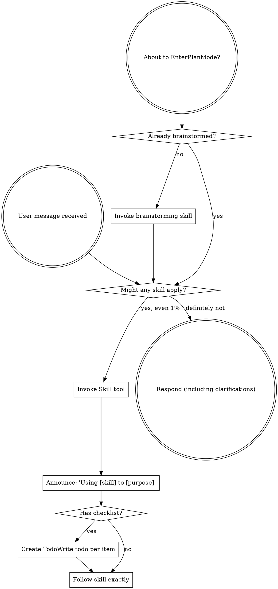

<SUBAGENT-STOP>
If you were dispatched as a subagent to execute a specific task, skip this skill.
</SUBAGENT-STOP>

<PHATIC-EXEMPTION>
If the user's message is PURELY phatic — a greeting, status check, or simple acknowledgment with ZERO substantive content — respond directly and naturally. Do NOT invoke skills. Do NOT check for skills.

Phatic (skip all skills, respond immediately):
- "在吗", "Hi", "Hello", "你好", "Good morning"
- "Are you there?", "Can I ask something?"
- "OK", "Thanks", "Got it", "👍", "好的"

Substantive (skills MAY apply, continue checking):
- Any message containing a task, question, instruction, or request for action
- "Fix this bug", "Add a login page", "What does this code do?", "帮我看下这个报错"

If you're unsure whether a message is purely phatic, default to treating it as substantive.
</PHATIC-EXEMPTION>

<TASK-TIERING>
Match workflow depth to task complexity. The full pipeline is NOT the default — it's the maximum.

### Level 0 — Trivial (typo, color, config value, comment, one-line fix)
**Workflow:** Direct edit. No analysis. No version doc. No skills except domain-specific ones.
**Examples:** "改按钮颜色为红色", "修复拼写错误", "更新版本号", "加一行注释"
**Skills to skip:** brainstorming, mms-dev-workflow, writing-plans, subagent-driven-development, verification-before-completion, finishing-a-development-branch

### Level 1 — Simple (single bug fix with clear cause, add one field/component, small isolated change)
**Workflow:** Systematic debugging (for bugs) OR quick analysis → direct implementation. Use TDD for code changes. Single code review before completion.
**Examples:** "加一个邮箱字段", "修复空指针异常", "给表格加排序功能"
**Skills to skip:** brainstorming, writing-plans, subagent-driven-development, finishing-a-development-branch
**Skills to use:** systematic-debugging (bugs only), test-driven-development, verification-before-completion

### Level 2 — Moderate (new feature, new page, multi-file change, cross-module work)
**Workflow:** mms-dev-workflow: analysis → version doc → develop → sync → review. Use TDD, code review.
**Examples:** "添加用户登录功能", "新建订单列表页", "对接支付接口"
**Skills to skip:** brainstorming, writing-plans, subagent-driven-development
**Skills to use:** mms-dev-workflow, test-driven-development, verification-before-completion, finishing-a-development-branch

### Level 3 — Complex (new subsystem, architecture change, greenfield project, multi-service)
**Workflow:** Full pipeline: brainstorming → writing-plans → subagent-driven-development. All quality gates.
**Examples:** "构建支付系统", "重构认证模块为微服务", "从零搭建管理后台"
**Skills to use:** brainstorming, writing-plans, subagent-driven-development, ALL quality gates

**Default rule:** If unsure, go ONE level up (not straight to Level 3).
**User override:** If user says "快速改"/"just do it"/"不用走流程", skip directly to Level 0 or 1.
</TASK-TIERING>

<EXTREMELY-IMPORTANT>
If you think there is even a 1% chance a skill might apply to what you are doing, you ABSOLUTELY MUST invoke the skill.

IF A SKILL APPLIES TO YOUR TASK, YOU DO NOT HAVE A CHOICE. YOU MUST USE IT.

This is not negotiable. This is not optional. You cannot rationalize your way out of this.
</EXTREMELY-IMPORTANT>

## Instruction Priority

Superpowers skills override default system prompt behavior, but **user instructions always take precedence**:

1. **User's explicit instructions** (CLAUDE.md, GEMINI.md, AGENTS.md, direct requests) — highest priority
2. **Superpowers skills** — override default system behavior where they conflict
3. **Default system prompt** — lowest priority

If CLAUDE.md, GEMINI.md, or AGENTS.md says "don't use TDD" and a skill says "always use TDD," follow the user's instructions. The user is in control.

## How to Access Skills

**In Claude Code:** Use the `Skill` tool. When you invoke a skill, its content is loaded and presented to you—follow it directly. Never use the Read tool on skill files.

**In Copilot CLI:** Use the `skill` tool. Skills are auto-discovered from installed plugins. The `skill` tool works the same as Claude Code's `Skill` tool.

**In Gemini CLI:** Skills activate via the `activate_skill` tool. Gemini loads skill metadata at session start and activates the full content on demand.

**In other environments:** Check your platform's documentation for how skills are loaded.

**In Codex (AGENTS.md context):** Codex does NOT have a native `Skill` tool. When AGENTS.md or a skill instructs you to "invoke a skill", use the `Read` tool to read the skill's `SKILL.md` file directly. Read only the skills matched to your current task tier. Do NOT attempt to use a `Skill` tool that doesn't exist. Do NOT retry failed tool calls — fall back to `Read` on the first attempt.

**Platform note:** Skills were designed for Claude Code's `Skill` tool. On Codex and Cursor, use `Read` to access `skills-shared/<skill-name>/SKILL.md`. The quality of execution depends on the skill content, not the access mechanism.

## Platform Adaptation

Skills use Claude Code tool names. Non-CC platforms: see `references/copilot-tools.md` (Copilot CLI), `references/codex-tools.md` (Codex) for tool equivalents. Gemini CLI users get the tool mapping loaded automatically via GEMINI.md.

# Using Skills

## The Rule

**Invoke relevant or requested skills BEFORE any response or action.** Even a 1% chance a skill might apply means that you should invoke the skill to check. If an invoked skill turns out to be wrong for the situation, you don't need to use it.

## Red Flags

These thoughts mean STOP—you're rationalizing:

| Thought | Reality |
|---------|---------|
| "I should check for skills before responding to this greeting" | Pure greetings are not tasks. Phatic exemption applies. Respond directly. |
| "This is just a simple question" | Questions are tasks. Check for skills. |
| "I need more context first" | Skill check comes BEFORE clarifying questions. |
| "Let me explore the codebase first" | Skills tell you HOW to explore. Check first. |
| "I can check git/files quickly" | Files lack conversation context. Check for skills. |
| "Let me gather information first" | Skills tell you HOW to gather information. |
| "This doesn't need a formal skill" | If a skill exists, use it. |
| "I remember this skill" | Skills evolve. Read current version. |
| "This doesn't count as a task" | Action = task. Check for skills. |
| "The skill is overkill" | Check TASK-TIERING. If Level 0 or 1, skipping IS correct. Only Level 2+ justifies the full skill. |
| "I'll just do this one thing first" | Check BEFORE doing anything. |
| "This feels productive" | Undisciplined action wastes time. Skills prevent this. |
| "I know what that means" | Knowing the concept ≠ using the skill. Invoke it. |

## Skill Priority

When multiple skills could apply, use this order — but ONLY for the tier appropriate to the task:

1. **Process skills first** (brainstorming, debugging) - these determine HOW to approach the task
2. **Implementation skills second** (frontend-design, mcp-builder) - these guide execution

**Skill selection by task type (NOT one-size-fits-all):**
- "Fix this bug" → systematic-debugging first, then domain skills. Skip brainstorming.
- "Let's build X" (new product/greenfield) → brainstorming → writing-plans
- "Let's build X" (existing project, new feature) → mms-dev-workflow, skip brainstorming
- "改个颜色/加个字段" → direct implementation, skip process skills entirely

## Skill Types

**Rigid** (TDD, debugging): Follow exactly. Don't adapt away discipline.

**Flexible** (patterns): Adapt principles to context.

The skill itself tells you which.

## User Instructions

Instructions say WHAT, not HOW — UNLESS the user explicitly overrides the workflow.

**User workflow override signals (honor immediately, no debate):**
- "快速改" / "just do it" / "直接改" → skip to Level 0/1
- "不用走流程" / "skip the process" → skip process skills
- "按规范来" / "按流程走" → follow the full pipeline for the task tier

**When user says "Add X" or "Fix Y" without specifying workflow:**
- Determine task tier from complexity (see TASK-TIERING)
- Apply appropriate workflow depth
- Do NOT default to Level 3 full pipeline for simple tasks
